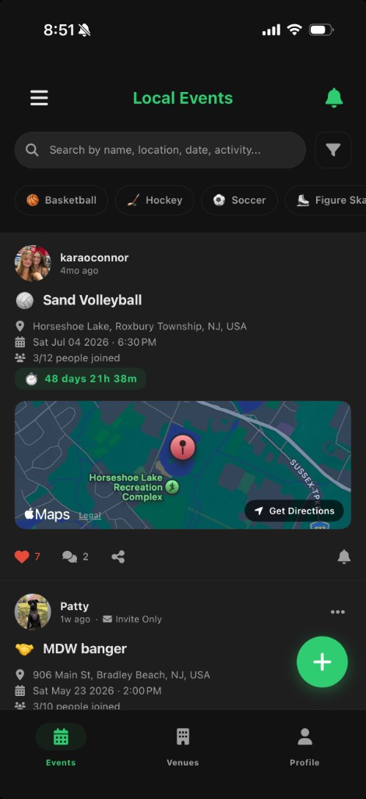
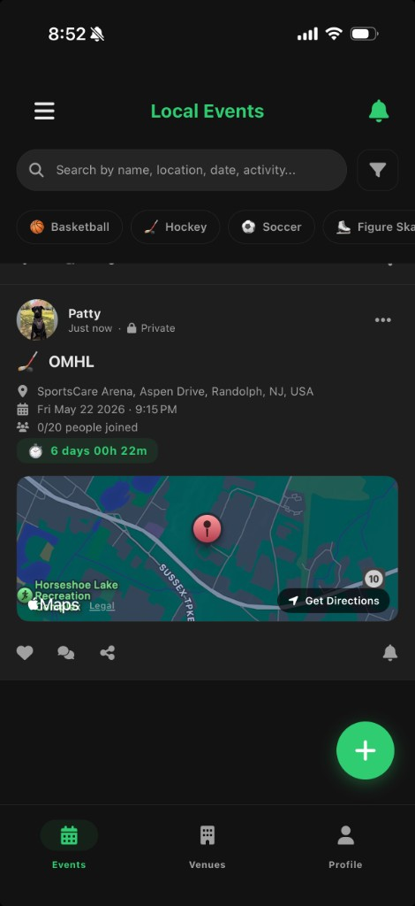

# BetterPlay

> Hangouts that actually happen.

  
  &nbsp;&nbsp;
  

BetterPlay is a cross-platform mobile app for planning local events,
discovering venues, and keeping recurring social rituals alive — from
one-off get-togethers to weekly trivia night with the regulars. It's
built to be the thing that finally replaces the group text that always
dies after three "we should hang out soon"s.

## Features

- **Plan events at a real place** with a date, a roster, and granular
  invite controls — public, private, or invite-only.
- **Discover nearby venues** via the Google Places API, filtered by the
  categories users actually plan around: bars, breweries, rinks, parks,
  bowling alleys, courts, coffee shops, and more.
- **Personalized feed** — pick your interests on your profile and the
  "All" view surfaces venues that match what you'd actually do, not
  generic chain restaurants.
- **In-app browser** — tap any venue to view its real website inside the
  app, check the live schedule, then plan an event from the page you're
  looking at with one tap.
- **Recurring events** for standing plans like Tuesday trivia or Friday
  pickup hockey, so a missed week doesn't kill the ritual.
- **Friends, profiles, and rosters** — connect with people, customize
  your profile, see who's in for each event, and manage waitlists.
- **Push notifications** for invites, comments, RSVPs, and event
  changes.
- **Cross-platform**: iOS and Android from a single codebase.

## Under the hood

A few of the more interesting bits beneath the surface:

- **Interest-based personalization.** The venues feed translates each
  user's selected interests into a tuned set of Google Places primary
  types (including the precise post-Feb-2026 categories) and feeds them
  as the filter. A minimum-ratings floor cuts dead-end results. Pick
  "Brewery" and you actually see breweries — not the nearest chain bar.
- **Plan-from-anywhere event creation.** The in-app browser captures
  the exact URL you're viewing as the event's source link, so a venue's
  "Trivia Tuesdays" page becomes the canonical link on the event card
  your friends see.
- **Defense-in-depth place filtering.** Some Google Places type
  categories can't be excluded server-side (API limitation), so a
  client-side post-pass against a superset list cuts the long tail of
  noise — no pool supply stores in the "Pools" feed.

## Built with

- **React Native + TypeScript** on the front end, shipping a single
  codebase to both iOS and Android.
- **Node.js + MongoDB** on the back end (separate repository).
- **Google Places** for venue discovery.
- **Firebase** for push notifications and analytics; **Sentry** for
  production crash monitoring.

## Status

Active development, currently in private beta via Firebase App
Distribution. Pre-release: APIs and data models are still evolving.

**Want to see it in action?** Happy to share a TestFlight or APK build
on request — reach out at oconnor-patrick@outlook.com / https://www.linkedin.com/in/patrick-o%E2%80%99connor-445b09172/.

## Roadmap

- **Groups & standing plans** — first-class "the trivia crew" /
  "the hockey guys" objects that own recurring event series, so a
  group's weekly ritual lives in one place instead of being re-typed
  every week.
- **Social proof on venues** — "3 friends have planned events here"
  badges, friend activity feeds, roster avatar previews on cards.
- **Group discovery** — surface open spots in nearby groups to users
  whose interests match, so new users without an existing crew can
  find one.
- **Venues feed visual refresh** — tiered layout with hero pick,
  themed shelves, and friend-driven shelves once social proof exists.

---

Built solo by Patrick O'Connor.
